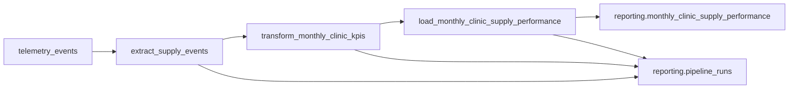

# HealthCore business performance pipeline — design

Design only. No Prefect code, no destination tables, and no route handlers ship from this file.

Company brief: [CONTEXT-data-pipeline.md](../../docs/Project_Contexts/CONTEXT-data-pipeline.md).  
Telemetry contract: [CONTEXT-healthcore.md](../../CONTEXT-healthcore.md).  
Engineering report (unchanged): `services/telemetry/analysis.py` and `GET /telemetry/report`.

**Purpose:** This pipeline produces the monthly, per-clinic rollup that feeds Dr. Okonkwo’s Monthly Clinic Supply Performance Report, also read by Claire, so that on the first working day of each month they have Supply Cost per Clinic, Supply Consumption Volume, Critical Stockout Frequency, and Expiry Risk Count computed from `inbound_order_created`, `outbound_order_created`, `stock_threshold_triggered`, and `supply_expiry_flagged`.

A stage that does not feed that sentence is out of v1.

---

## Phase 1 — Current State

### What is already stored

Backoffice telemetry is appended to Supabase `telemetry_events`. The row is immutable. There is no UPDATE or DELETE API for it.

| Column | Role |
|--------|------|
| `id` | uuid primary key. Tie-break when two rows share an `eventId`. |
| `timestamp` | timestamptz. When the fact happened (envelope `timestamp`), not when a pipeline loads it. |
| `service` | text. Capture path uses `backoffice`. |
| `event_type` | text. `entity_action` name. |
| `level` | text. `info`, `warn`, or `error`. |
| `value` | numeric, optional. Latency and similar technical measures. |
| `message` | text, optional. |
| `tags` | jsonb. Allowlisted properties plus `eventId`, `sessionId`, `userId`, `schemaVersion`, `requestId`. |

Staff clients batch events about every 10 seconds or 20 events and flush with `sendBeacon` when the page hides. `POST /telemetry/events` validates each item and bulk-inserts the valid ones. The table therefore grows by insert. It does not revise an existing business fact in place.

The implemented catalogue in [telemetry-plan.md](../../docs/telemetry/telemetry-plan.md) records inventory movement as `inbound_order_created`, `outbound_order_created`, and `stock_threshold_triggered`, with properties such as `product_id`, `sku`, and `quantity`. Those events do not yet include `clinic_id`, `country`, `department`, or `total_cost`. `supply_expiry_flagged` is required by [CONTEXT-healthcore.md](../../CONTEXT-healthcore.md) and is not in the implemented catalogue. This design names the extract contract. It does not add emitters.

### What the technical report already answers

`GET /telemetry/report` calls `services/telemetry/analysis.py`. For a UTC window it returns:

- event volume by `event_type` and day
- error rate by event type
- API latency per day
- login failure rate

That is an engineering radar: volume, errors, latency, authentication failures. It is not a clinic supply pack. It does not sum purchase cost, count consumption by clinic, count threshold crossings by clinic, or count expiry flags. This pipeline does not change that module or that route, and it does not write its output into `telemetry_events`.

### Gap

Dr. Okonkwo and Claire still cannot read, by clinic and by country, how much supply a clinic purchased, how many consumption events it recorded, how often stock crossed under the minimum, or how many batches were flagged as nearing expiry. Those four numbers are the Monthly Clinic Supply Performance Report. They need their own table, `reporting.monthly_clinic_supply_performance`, and their own routes under `services/reporting/`.

---

## Phase 2 — Pipeline design

### Extraction

**Source table:** `telemetry_events` (read-only).

**Other inputs:** a static clinic allowlist copied from the distinct `clinic_id` values in `scripts/samples/incidents-healthcore.csv` (`us-tx-001`, `us-tx-002`, `us-fl-001`, `us-fl-002`, `us-ga-001`, `us-ga-002`, `uk-lon-001`, `uk-lon-002`, `uk-man-001`, `uk-man-002`). The pipeline does not join the incident file. That file contains `patient_id`, which this pipeline must not read.

**Filter (SQL):**

- `event_type IN ('inbound_order_created', 'outbound_order_created', 'stock_threshold_triggered', 'supply_expiry_flagged')`
- `timestamp >= :month_start AND timestamp < :month_end` in UTC
- `:month_start` is the first day of the calendar month. `:month_end` is the first day of the next month (inclusive start, exclusive end).

**Payload shape of each extracted row:**

| Field | Where it lives |
|-------|----------------|
| `id`, `timestamp`, `event_type` | columns |
| `eventId`, `sessionId`, `requestId` | `tags` |
| `clinic_id`, `country` | `tags` (property keys stored inside `tags`) |
| `total_cost` | `tags`, inbound only. Numeric order cost in the clinic currency. |
| `department` | `tags`, outbound only. Allowlist: `general_consultation`, `chronic_care`, `primary_care`, `specialty_care`, `chronic_disease_management`. |
| `product_id`, `product_category`, `quantity` | `tags`, as required per event in the CONTEXT |
| `expiry_date` | `tags`, `supply_expiry_flagged` only |

**How often the source changes:** continuously, as backoffice batches arrive. **How often the rollup is published:** once for the previous UTC month at 06:00 UTC on the 1st, so the pack exists before the first working day. A manual trigger can recompute one named month. A late event recomputes only the UTC month of that event’s `timestamp`.

**Acceptance.** Drop a row, and add 1 to `records_rejected`, when any of these fail:

- `eventId` is missing
- `clinic_id` is not on the allowlist
- `country` is not `US` or `UK`, or it disagrees with the id prefix (`us-` / `uk-`)
- inbound `total_cost` is missing or negative
- outbound `department` is missing or outside the allowlist
- `supply_expiry_flagged` has no `expiry_date`
- a required product field for that event is missing

Do not substitute 0 for a missing cost. A rejected inbound event is absent from `total_supply_cost`. A clinic with only rejected events still gets a zero row, and the run log shows the rejects.

### Data flow



1. **Extract** reads the four event types for one UTC month, deduplicates on `tags.eventId` (earliest `timestamp`, then smallest `id`), and splits accepted rows from rejected rows.
2. **Transform** groups accepted rows by `clinic_id`. It sums inbound `total_cost`, counts the other three event types, attaches `country` and `currency` (`US` → `USD`, `UK` → `GBP`), and left-joins the clinic allowlist so every allowlisted clinic has a row. Clinics are not summed across currency.
3. **Load** upserts those rows into `reporting.monthly_clinic_supply_performance` on `(clinic_id, month_start)` inside one transaction and sets `computed_at`.

### When the source inserts and the destination must change

`telemetry_events` only inserts. The same clinical fact can still arrive twice (client retry, duplicate `eventId`). The extract step keeps one row per `eventId`. It does not update `telemetry_events`.

The published number for a clinic-month **does** change when a later run sees more accepted events, or when a late event falls in a month that was already published. The concrete mechanism is a full recompute of that month followed by:

```sql
INSERT INTO reporting.monthly_clinic_supply_performance (
  clinic_id, country, month_start,
  total_supply_cost, supply_consumption_count,
  critical_stockout_count, expiry_risk_count,
  currency, computed_at
) VALUES (...)
ON CONFLICT (clinic_id, month_start) DO UPDATE SET
  country = EXCLUDED.country,
  total_supply_cost = EXCLUDED.total_supply_cost,
  supply_consumption_count = EXCLUDED.supply_consumption_count,
  critical_stockout_count = EXCLUDED.critical_stockout_count,
  expiry_risk_count = EXCLUDED.expiry_risk_count,
  currency = EXCLUDED.currency,
  computed_at = EXCLUDED.computed_at;
```

A second insert of the same clinic-month is impossible while the unique constraint holds. Recomputing from deduped events means the update replaces the KPI values. It does not add them to the previous values.

### Destination and routes

| Object | Name |
|--------|------|
| KPI table | `reporting.monthly_clinic_supply_performance` |
| Run log | `reporting.pipeline_runs` |
| Status | `GET /reporting/pipeline-runs/latest` |
| Manual trigger | `POST /reporting/pipeline-runs` |
| KPI query | `GET /reporting/monthly-clinic-supply-performance` |

These are not `telemetry_events` and not `GET /telemetry/report`. DDL and the KPI JSON shape are in the CONTEXT. Example `clinic_id` in responses is `us-tx-001`, not a slogan slug.

---

## Phase 3 — Resilience and idempotency

Three properties the pipeline has to demonstrate: a repeated run does not duplicate or corrupt a clinic-month, every run leaves an audit row, and a failure mid-load is repaired by recomputing and upserting.

### Idempotency strategy

Dedup and upsert are both required. Either one alone is not enough.

1. **Extract** collapses duplicate `eventId` values before any sum or count. Two `inbound_order_created` rows with the same `eventId` and different receive times contribute one `total_cost`.
2. **Transform** rebuilds the full allowlist for that `month_start` from the deduped set. It does not read the previous KPI numbers and add to them.
3. **Load** writes the whole month in one transaction with `ON CONFLICT (clinic_id, month_start) DO UPDATE`.

**Second run after a load-phase failure.** Example: the 02:00 run inserted some clinic rows, then Supabase timed out. `pipeline_runs.status` is `Failed`, `phase` is `load`, `ended_at` is set, and `error_message` records the timeout. The next run (cron retry or `POST /reporting/pipeline-runs` for the same `month_start`) does not resume by inserting the remainder. It extracts the month again, deduplicates, transforms every allowlisted clinic, and upserts every row. Clinics that were written before the timeout are updated to the recomputed figures. Clinics that were not written are inserted. The unique key prevents a second row. The KPI table matches a clean run of that same source window. `computed_at` changes. The KPI numbers do not, unless the source window itself gained or lost accepted events between the two runs. Each attempt has its own `run_id`.

### Execution log

Table: `reporting.pipeline_runs`. One row per attempt. Written at the start (`status = Running`) and updated at each phase boundary and at the end.

| Field | Type | Why it has to be there |
|-------|------|------------------------|
| `run_id` | uuid | Distinguishes this attempt from a rerun of the same month. Trace joins use it. |
| `flow_name` | text | Shows which flow wrote the row (`monthly_clinic_supply_performance`). |
| `month_start` | date | The partition that was recomputed. Late-event and overlap locks key on it. |
| `trigger` | text | `schedule` or `manual`. Explains why two runs exist for one month. |
| `started_at` | timestamptz | When the attempt began. Stale-lock recovery compares it to now. |
| `ended_at` | timestamptz, nullable | When it finished. Null while `Running`. Separates an open run from a finished one. |
| `status` | text | `Running`, `Completed`, or `Failed`. The status route and the silence check read this. |
| `phase` | text | `extract`, `transform`, or `load`. Checkpoint for where a failure stopped. |
| `records_extracted` | integer | Rows read from `telemetry_events` before dedup. Volume versus the next run. |
| `records_deduped` | integer | Rows after `eventId` collapse. The numerator the transform actually used. |
| `duplicate_event_id_count` | integer | How many extra source rows were dropped as duplicate `eventId`s. |
| `records_rejected` | integer | Rows dropped for missing clinic, cost, department, or country. A zero KPI is not a silent reject. |
| `records_loaded` | integer | Clinic-month rows upserted. For a full allowlist this is 10. A short count means the load did not finish. |
| `distinct_clinic_count` | integer | Allowlisted clinics that had at least one accepted event. Compared with event volume. |
| `distinct_session_count` | integer | Distinct `sessionId` on accepted events. Compared with event volume. |
| `distinct_request_id_count` | integer | Distinct `requestId` on accepted events. Joins a burst back to API traffic. |
| `error_message` | text, nullable | Stable failure reason (`supabase_timeout`, `stale_running`). No event payloads, no PHI, no secrets. |

### Design questions

#### Idempotency

**1. Duplicates at the source.** An operator action can land twice within a few hundred milliseconds: two `telemetry_events` rows, same `tags.eventId`, different insert times. The dedup key is `eventId`, applied in **extract**, before transform. Keep the earliest `timestamp`, then the smallest `id`. Do not upsert `telemetry_events`. The destination never sees the duplicate, so `total_supply_cost` and the three counts cannot double-count that action. A second pipeline run dedups again and upserts the same clinic-month, so the published row still matches.

**2. Re-run after a failed load.** If the load wrote some of the clinic rows and then lost the database connection, those rows are a partial month, not a second copy of events. The rerun recomputes the month from `telemetry_events` and upserts on `(clinic_id, month_start)`. Already-written clinics are updated in place. Missing clinics are inserted. There is no “add the rest” path that would sum the partial load with the new load. The outcome matches a clean run against the same source window.

**3. Late events.** A `supply_expiry_flagged` row can be stored at 23:50 with a noon `timestamp` on a day whose month was already published. The month key is `date_trunc('month', timestamp)` in UTC, not the insert time. The pipeline starts a new run whose `month_start` is that month, recomputes all four KPIs for every allowlisted clinic, and upserts. The previous published figures are replaced, not incremented. The new `pipeline_runs` row records `trigger`, `run_id`, and `error_message` left null on success. `records_*` show what the invalidating run accepted. The old run row stays, so the audit trail still shows the earlier publication.

#### Observability

**4. Silence versus a true zero.** A clinic that had no accepted supply events still gets a row of zeros because transform left-joins the allowlist. A completed `pipeline_runs` row with `records_loaded = 10` is the heartbeat: the job ran and the zeros are measured. If nobody can find a `Completed` row for that `month_start`, the pack was not produced. The silence signal is the absence of that run, not a missing clinic line. By the first working day, operations expect a `Completed` run for the previous month. A `Failed` row is not a zero; `error_message` says why.

**5. Collection traceability.** Each run stores `run_id`, `records_extracted`, `records_deduped`, `duplicate_event_id_count`, `distinct_request_id_count`, and the min/max fact times implied by the month window. A 09:00 spike that flatlines at 09:15 is checked by asking whether one `run_id` loaded a single `month_start` (this flow always does) and whether `duplicate_event_id_count` jumped. Two windows processed at once would show two `month_start` values or a `records_loaded` that is not the allowlist size. A gap shows up as `records_rejected` or as a drop in `distinct_request_id_count` while the backoffice was otherwise in use. `requestId` stays on the source event; the run stores the count, not a dump of ids, so logs stay free of clinical free text.

**6. Growth versus lost or duplicated measurements.** Compare `records_deduped` with `distinct_clinic_count` and `distinct_session_count` on the same run, and compare those three with the previous month’s `Completed` run. More events with the same clinics and sessions is more supply activity. More events with a rising `duplicate_event_id_count` is duplication, and the dedup step already keeps those out of the KPIs. Fewer events while `distinct_session_count` collapses, or a jump in `records_rejected`, is a capture gap, not a quiet clinic. Monday versus Sunday volume can differ because clinics operate fewer hours; the clinic and session counts are what stop that pattern from being read as data loss. This comparison uses the four source events only. It does not add those other events to the KPIs.

#### Recoverability

**7. Database outage.** Extract and transform do not need a partial file. They are read-only and pure. The checkpoint is `pipeline_runs.phase`. If the connection drops during `INSERT` into `reporting.monthly_clinic_supply_performance`, the run is marked `Failed` at `phase = load` when the failure is caught. If the process dies before it can write that, a later trigger treats a `Running` row whose `started_at` is older than 30 minutes as `Failed` with `error_message = stale_running`, then starts a new `run_id`. Recovery is not “continue the INSERT from row 848.” Recovery is a new run that recomputes the month and upserts. The unique key makes the partial insert harmless.

**8. Frontend buffer.** The browser already buffers a short batch and flushes on a timer or when the page hides. That buffer stays in capture (`uis/backoffice`). This pipeline does not add `localStorage` storage and does not replay the client. A 20-minute offline stretch can deliver a late batch or lose events if the tab is discarded. Late arrivals are recovered by the late-event recompute (question 3). Duplicates from a retry are recovered by `eventId` dedup (question 1). Events that never leave the browser are a capture gap and show up as question 6, not as something the load step can invent.

**9. Transmission retry.** Part 1 does not change `POST /telemetry/events`. A client timeout can follow a server insert that already succeeded, and a second POST can insert the same `eventId` again. The pipeline treats that as question 1: extract keeps one row. The published KPIs do not depend on the telemetry route returning a special “already stored” status. A later change may use `eventId` as an idempotency key and return 200 without a second insert. That change is outside this design and must not alter `GET /telemetry/report`.

#### Cross-cutting

**10. Concurrent runs.** The scheduled flow and `POST /reporting/pipeline-runs` take the same lock: at most one `pipeline_runs` row with `status = Running` for (`flow_name`, `month_start`). The run inserts that row first, with a new `run_id`. If the insert conflicts, the trigger returns a conflict and does not extract or load. The scheduled run that started at 02:00 keeps going. The manual click at 02:05 does not write a second set of clinic rows. When the first run reaches `Completed` or `Failed`, the lock is gone and a later manual run may recompute. A `Running` row older than 30 minutes is closed as `stale_running` before the lock is taken again (question 7).

---

## Phase 4 — Mapping to Prefect

One main flow. Three tasks (Part 2). Part 3 wraps those stages as subflows coordinated by the main flow in `data/pipelines/pipeline.py`.

| Prefect concept | Name | What it does |
|-----------------|------|----------------|
| Flow | `monthly_clinic_supply_performance` | One UTC `month_start`. Takes the run lock, runs the three subflows, sets `Completed` or `Failed`. |
| Subflow (Part 3) | `extract_clinic_supply_telemetry` | Calls task `extract_supply_events`. Explicit input: `month_start`. Output: extract result dict. |
| Subflow (Part 3) | `transform_monthly_clinic_supply_kpis` | Calls task `transform_monthly_clinic_kpis`. Inputs: extract result + `month_start`. Output: clinic-month rows. |
| Subflow (Part 3) | `load_monthly_clinic_supply_performance` | Calls task `load_monthly_clinic_supply_performance`. Input: rows. Output: records loaded. |
| Subflow (Part 3, optional) | `snapshot_monthly_clinic_supply_eval` | Non-critical eval write; main flow uses `return_state=True`. |
| Task | `extract_supply_events` | SQL read of `telemetry_events`, `eventId` dedup, reject counts. Sets `phase = extract`. |
| Task | `transform_monthly_clinic_kpis` | Clinic-month KPIs plus zero rows for the allowlist. No database write. Sets `phase = transform`. |
| Task | `load_monthly_clinic_supply_performance` | Single-transaction upsert into `reporting.monthly_clinic_supply_performance`. Sets `phase = load`. |
| Flow (optional, not in Part 1) | `backfill_monthly_clinic_supply_performance` | Would call the same flow once per month in a range. |

**Part 3 additional activity (design question 10):** Concurrent-run lock (`pipeline_runs` one `Running` row per `flow_name` + `month_start`, plus stale `Running` cleanup) shipped in Part 2 and remains the answer to question 10 — no second lock layer was added in Part 3.

**States used**

| State | When |
|-------|------|
| `Running` | Lock row inserted. `ended_at` is null. |
| `Completed` | Load transaction committed. `records_loaded` is the allowlist size. |
| `Failed` | A task raised, the upsert rolled back or timed out, or a stale `Running` row was closed. |

Scheduled start: 06:00 UTC on the 1st, for the previous UTC month. Parameter `month_start` overrides that for a manual or late-event run.

**CLI run command (Part 2):**

```bash
python data/pipelines/pipeline.py
python data/pipelines/pipeline.py --month-start 2026-09-01
```

Default month is the previous UTC month. Option A: when `telemetry_events` has no accepted clinic-tagged rows for that month, extract loads [`data/raw/monthly_clinic_supply_events.json`](../raw/monthly_clinic_supply_events.json). Local reporting SQLite (when no Supabase URI) is `data/process/reporting.db` and is gitignored.

**Prefect block:** `healthcore-supabase`, a connection block that holds the same Supabase URI the API already reads from `SUPABASE_DATABASE_URL`. Tasks open the warehouse through the block. The URI is not written into this document, into source, or into git. Do not commit `.env`.

---

## Phase 5 — Application integration

The three routes live in a new `services/reporting/` package and are included from the existing FastAPI app (`services/api`, port 8001). They require the existing bearer JWT. They contain no SQL aggregation and no Prefect task bodies.

`data/pipelines/` does not import `services/`.

| Endpoint | Role | Function it imports |
|----------|------|---------------------|
| `GET /reporting/pipeline-runs/latest` | Status of the latest run: `run_id`, `status`, `phase`, `started_at`, `ended_at`, `month_start`, `records_extracted`, `records_loaded`, `records_rejected`, `error_message`. | `latest_pipeline_run` in `data/pipelines/monthly_clinic_supply/runs.py` |
| `POST /reporting/pipeline-runs` | Manual trigger. Body may include `month_start`. Omitted means the previous UTC month. Conflict when that month is already `Running`. | `trigger_monthly_clinic_supply_performance` in `data/pipelines/monthly_clinic_supply/flow.py` |
| `GET /reporting/monthly-clinic-supply-performance` | KPI query for the dashboard. Optional `month_start`. Default is the latest `month_start` stored in `reporting.monthly_clinic_supply_performance`. Returns `month_start` and `clinics[]` as in the CONTEXT. | `query_monthly_clinic_supply_performance` in `data/pipelines/monthly_clinic_supply/query.py` |

`trigger_monthly_clinic_supply_performance` is the only function that starts the Prefect flow `monthly_clinic_supply_performance`. The scheduled deployment calls that same flow, so cron and the manual route share the lock in Phase 3.

`query_monthly_clinic_supply_performance` only reads the KPI table. It does not run extract, transform, or load.

None of these functions call `services/telemetry/analysis.py` or change `GET /telemetry/report`.
