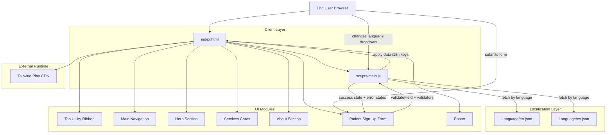

# Healthcore Landing Page Architecture Diagram

```mermaid
flowchart TB
    U[End User Browser]

    subgraph Client[Client Layer]
        I[index.html]
        J[scripts/main.js]
    end

    subgraph Content[Localization Layer]
        EN[Language/en.json]
        ES[Language/es.json]
    end

    subgraph External[External Runtime]
        TW[Tailwind Play CDN]
    end

    subgraph UI[UI Modules]
        TOP[Top Utility Ribbon]
        NAV[Main Navigation]
        HERO[Hero Section]
        SRV[Services Cards]
        ABT[About Section]
        FRM[Patient Sign-Up Form]
        FTR[Footer]
    end

    U --> I
    I --> TW
    I --> J

    I --> TOP
    I --> NAV
    I --> HERO
    I --> SRV
    I --> ABT
    I --> FRM
    I --> FTR

    J -->|fetch by language| EN
    J -->|fetch by language| ES

    J -->|apply data-i18n keys| I
    U -->|changes language dropdown| J

    U -->|submits form| FRM
    FRM -->|validateField + validators| J
    J -->|success state + error states| FRM
```
